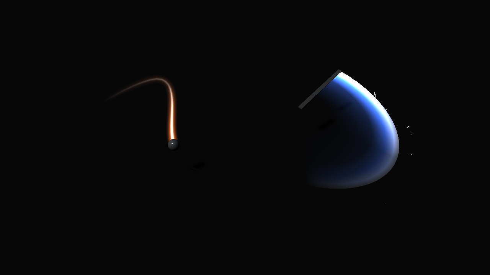

# slash-trail

A Maya tool for adding glowing motion trails to animated objects. Sword
swings, punches, kicks, a thrown ball. You pick the object, press Create, and
get a ribbon that lights up behind it and fades out over a few frames.



It has two modes. By default the trail follows the object's pivot, with a
fixed width, turned to face a camera (or lined up with one of the object's
axes). Tick "Use blade" and it sweeps between a base and a tip instead, which
is what you want for weapons.

## Why

When blocking a fight it helps to see the slash shapes early, before any FX
work. Doing that by hand means duplicating geometry per frame or setting up
particles, and redoing it every time the timing changes.

This builds the trail from the animation directly. Positions are evaluated
with an `MDGContext` at sub-frame times, so the timeline doesn't move and keys,
constraints and IK all work. The whole path becomes one ribbon mesh, and a
keyed ramp on the shader only shows the part right behind the object (game
engines draw weapon trails the same way). Settings live on the trail node, so
after retiming you select it and rebuild.

## Install

Clone or download the repo, then drag `install_slash_trail.py` into the Maya
viewport.

The installer writes `slash_trail.mod` into your `Documents/maya/modules`
folder, so Maya picks the tool up on every launch. It also adds a "Slash"
button to the current shelf and loads the tool into the running session, so
you don't need to restart. If you move the folder later, drag the file in
again. To uninstall, delete `slash_trail.mod` and the shelf button.

At a studio you can put the same `.mod` file on a shared `MAYA_MODULE_PATH`
instead, or use the Rez package (`rez env slash_trail maya`).

## Using it

Click the Slash shelf button, or run:

```python
from slash_trail import ui
ui.show()
```

If an object is selected when the window opens, it gets filled in and the
settings are fitted to its motion: the frame range is cropped to where it
actually moves, and trail length, samples per frame, width and sparks are
set from its speed and size. Select two objects (hilt, then tip) to start in
blade mode.

Selecting an existing trail in Maya loads its settings into the window. Change
whatever you like and press Rebuild Selected. With several trails selected,
Rebuild Selected rebuilds each one from its own stored settings, which is
handy after changing the animation.

| Section | Fields |
|---|---|
| Source | object, width, face (camera / x / y / z), camera; "Use blade" with tip, axis and length |
| Timing | start, end, From timeline, Fit to motion, trail length (frames), samples per frame |
| Look | glow color, glow strength, white-hot edge, inner edge |
| Sparks | on/off, count, speed, life, seed |

Buttons: Create, Rebuild Selected, Load Selected, Delete Selected.

From a script:

```python
from slash_trail import maya_build, settings

# streak behind a fist, facing the shot camera
punch = maya_build.create(settings.TrailSettings(
    base="fist_ctl", width=8, camera="shotCam",
    start=101, end=112, trail_frames=4,
))

# sword slash, blade along the hilt control's local Y
slash = maya_build.create(settings.TrailSettings(
    base="sword_ctl", use_blade=True, axis="y", length=90,
    start=101, end=112, trail_frames=5,
    color=(1.0, 0.35, 0.1), sparks=True,
))

maya_build.rebuild(slash)   # after changing the animation
maya_build.delete(punch)
```

## What it creates

```
sword_slashTrail         transform, settings stored as JSON
|-- trailMesh            ribbon, two vertices per sample
`-- sparks               optional
    |-- spark1..N        streak quads keyed along their velocity

standardSurface, emission only
  opacity  = age ramp (U, place2dTexture frame keyed over time) * edge ramp (V)
  emission = core ramp (V), white-hot at the tip or down the middle
```

## Tests

Without Maya (the UI tests need PySide6):

```
pip install -e ".[test,ui]"
pytest
```

Inside Maya, which also builds real trails and checks the mesh, keys and ramp
values:

```
mayapy -m pytest
```

## Layout

```
install_slash_trail.py        drop into the viewport to install
python/slash_trail/
    settings.py          TrailSettings, validation, JSON
    auto.py              suggested settings from speed and size
    ribbon.py            sample times, ribbon edges, mesh data
    reveal.py            keys for the moving window
    look.py              ramp values for blade and point trails
    sparks.py            spark generation
    vecmath.py           small vector helpers
    constants.py         defaults and names
    maya_sample.py       positions at sub-frame times (API 2.0)
    maya_build.py        mesh, shader, keys, rebuild, delete
    ui.py                Qt window
    install.py           module file and shelf button
    test/
```

See `WALKTHROUGH.md` for how each part works.
